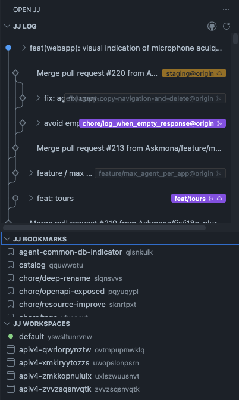

# OPEN JJ (VS Code)

Jujutsu (jj) integration for VS Code. Graphical log, end-to-end GitHub PR workflow (push, open, track status), and one-click parallel workspaces so you can hack on two changes side-by-side without switching branches.

## Highlights

- **One-click parallel workspaces.** Right-click any change → "Open in New Workspace Window" spawns a fresh VS Code window with its own `jj workspace` rooted at that change. Keep writing code in your main window while a slow build or a speculative refactor runs in the other.
- **Workspaces panel.** A dedicated "JJ Workspaces" view lists every workspace attached to the repo, marks the one your current session is using, and lets you forget (and optionally delete on disk) stale workspaces without leaving your main window.
- **Graphical jj log.** Column-based DAG renderer with working-copy highlight, immutable/locked markers, dashed elided-history lines, and inline file lists.
- **Drag-and-drop everything.** Drag a change onto another to rebase. Drag a file between changes to squash/move it. Drag a bookmark to retarget it.
- **End-to-end GitHub workflow.** Push a bookmark, open a PR, and track its state without leaving the panel. Bookmark badges reflect live PR status (open, draft, merged, closed), click them to jump to the PR, and protected branches are detected so the "create PR" action picks a sensible base.

## Parallel workspaces

`jj workspace` lets a single repo have multiple working copies, each with its own `@`. This extension makes them first-class:

1. Right-click any change in the log → **Open in New Workspace Window**.
2. A new VS Code window opens in a temp directory (`$TMPDIR/jj-workspaces/<repo>-<changeId>`) rooted at that change.
3. Edit, build, test in parallel — both windows stay in sync with the shared repo.
4. When you're done, open the **JJ Workspaces** view in your main window and pick "Forget Workspace". You can optionally also delete the folder on disk in the same step.

The current session's workspace is marked with a green indicator and can't be forgotten from its own window — switch to the main window to clean it up.

## GitHub workflow

Sign in once via **GitHub Auth** in the Log view's title bar (uses VS Code's built-in GitHub authentication), then the panel stays in sync with your pull requests:

- **Push bookmark** — right-click a bookmark badge → *Push Bookmark*. Runs `jj git push` for that bookmark and refreshes PR status.
- **Push and create PR** — same menu. Pushes the bookmark, picks the nearest ancestor bookmark that exists on the remote as the base, and opens the GitHub compare page pre-filled.
- **Create PR** (already pushed) — opens the compare page without re-pushing.
- **Live PR status badges** — each bookmark badge shows its PR state (open / draft / merged / closed) with distinct colors. Click to open the PR in your browser.
- **Protected-branch awareness** — branches marked protected on GitHub are used as PR base candidates and get a subtler badge treatment so they don't look like your own work.
- **Auto-refresh** — PR state is cached briefly and refreshed on fetch, push, and periodic window focus, so badges reflect reality without manual reloads.

## Views

- **JJ Log** — graphical DAG with inline files and bookmarks.
- **JJ Bookmarks** — local and remote bookmarks.
- **JJ Workspaces** — all workspaces attached to the repo, with forget / reopen actions.

## UI and menus

### View title buttons (JJ Log)

- Refresh
- Fetch
- GitHub auth

### Change context menu (log rows)

- Describe / Edit
- Squash into parent
- Abandon
- Manage bookmarks
- New change from here
- Open in New Workspace Window
- Copy change id

### File context menu (expanded files)

- Open file
- Open diff
- Revert file
- Move file to change

### Workspace context menu

- Open Workspace Window (for workspaces created by this extension)
- Forget Workspace

## Bookmark colors

Badges appear next to a change title and reflect bookmark/PR state:

- Local: VS Code badge colors (not pushed)
- Tracked: blue (pushed, no PR)
- PR open: purple
- PR draft: gray-purple
- PR closed: red
- PR merged: green
- Remote-only: dim
- Conflicted: amber border

## Graph colors

- Lines: VS Code description foreground
- Nodes: hollow circles by default
- Working copy: filled blue circle
- Immutable (locked): hollow squares

## Commands

Available in the Command Palette:

- Initialize Repository / Initialize with Git Backend
- New Change, Describe, Edit, Squash, Abandon
- Manage / Create / Delete / Set Bookmark
- Refresh, Fetch, GitHub Auth
- Rebase Change, Move File to Change
- Forget Workspace, Open Workspace Window

## Requirements

- `jj` installed and on your PATH (or set `open-jj.path`).

## Configuration

- `open-jj.path`: path to the jj executable
- `open-jj.autoRefresh`: refresh views on file changes
- `open-jj.logLimit`: max log entries to load (set to 0 for unlimited)
